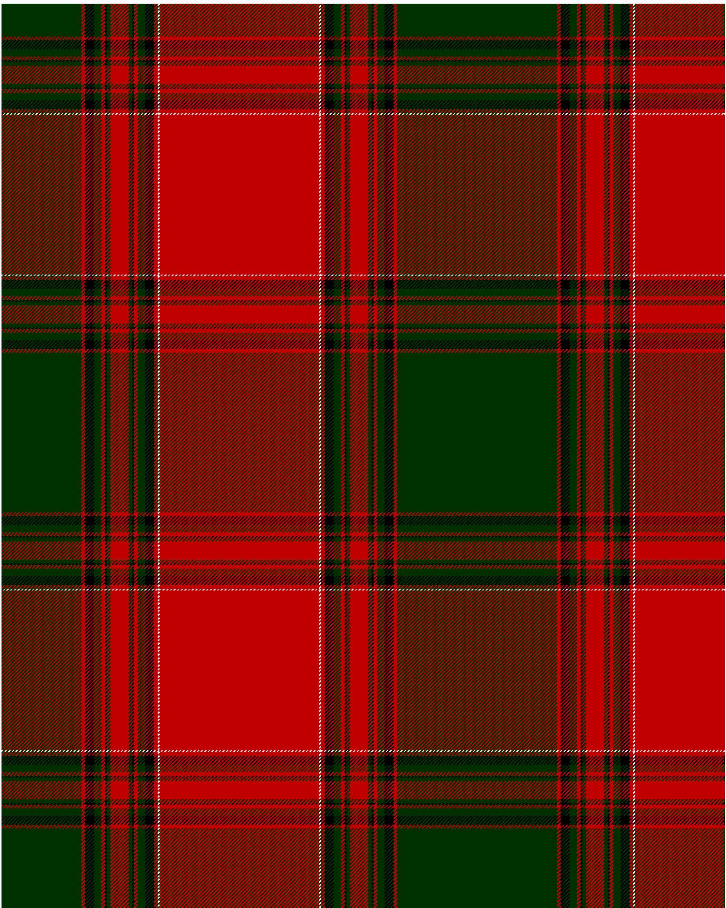

Gudbrandsdalen, Mannsdrakt

This was sourced from <no value>.  It is a 16 stripes tartan.

Original link http://www.weddslist.com/cgi-bin/tartans/pg.pl?source=sts

## Thread count
DG/88 R4 K10 DG8 R4 K2 DG4 R20 DG4 K2 R4 DG8 K10 R4 LN2 R/88

## Palette
DG#003000 K#000000 LN#E0E0E0 R#C00000

# Sample pattern

ID: /variants/dg/88/r4/k10/dg8/r4/k2/dg4/r20/dg4/k2/r4/dg8/k10/r4/ln2/r/88-dg003000-k000000-lne0e0e0-rc00000