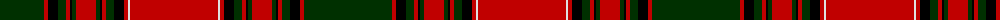

The parent of this is [Gudbrandsdalen, Mannsdrakt](/tartans/dg/88/r4/k10/dg8/r4/k2/dg4/r20/dg4/k2/r4/dg8/k10/r4/ln2/r/88/)

This was sourced from weddslist.  It is a [16 stripes tartan](/stripes/stripes16/).

Original link http://www.weddslist.com/cgi-bin/tartans/pg.pl?source=sts

## Thread count
DG/88 R4 K10 DG8 R4 K2 DG4 R20 DG4 K2 R4 DG8 K10 R4 LN2 R/88

## Palette
Each colour and its ΔE from the base-6 reference it is a variant of.

| Colour | Shade | Base | ΔE (OKLab) |
|---|---|---|---|
| DG |  `#003000` | G  | 0.18 |
| K |  `#000000` | K  | 0.00 |
| LN |  `#E0E0E0` | W  | 0.06 |
| R |  `#C00000` | R  | 0.02 |

ID: /variants/dg/88/r4/k10/dg8/r4/k2/dg4/r20/dg4/k2/r4/dg8/k10/r4/ln2/r/88-dg003000-k000000-lne0e0e0-rc00000/
