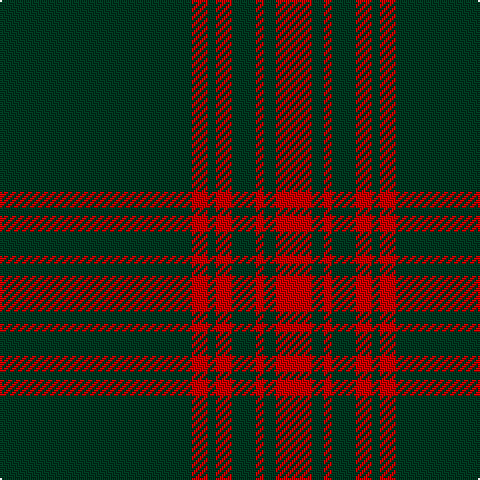

The parent of this is [Menzies Hunting Clan Tartan Tartan Number: 894. Earliest known date: 1893 This sett is woven in various colours with the same basic design. The certified version is red and black. The hunting Menzies was recorded by D.W. Stewart in his book, 'Old and Rare Scottish Tartans' (1893), which contained a selection of forty five setts, woven in silk, of special interest or antiquity. See products available Copyright © Blair Urquhart, Comrie, 2015](/tartans/dg/96/r8/dg4/r8/dg12/r4/dg6/r/18/)

This was sourced from house-of-tartan.  It is a [8 stripes tartan](/stripes/stripes8/).

Original link http://www.house-of-tartan.scotland.net/house/TartanViewjs.asp?colr=Def&tnam=894

## Thread count
DG/96 R8 DG4 R8 DG12 R4 DG6 R/18

## Palette
Each colour and its ΔE from the base-6 reference it is a variant of.

| Colour | Shade | Base | ΔE (OKLab) |
|---|---|---|---|
| DG |  `#003820` | G  | 0.16 |
| R |  `#C80000` | R  | 0.00 |

# Sample pattern

ID: /variants/dg/96/r8/dg4/r8/dg12/r4/dg6/r/18-dg003820-rc80000/
