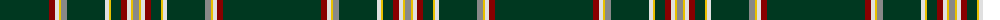

The parent of this is [Hogan (Name)](/tartans/dg/98/dr6/ln4/y2/n6/dg38/ln4/y2/dg10/dr6/ln4/y2/n/6/)

This was sourced from tartans-authority.  It is a [13 stripes tartan](/stripes/stripes13/).

Original link http://www.tartansauthority.com/tartan-ferret/display/10071/

## Thread count
DG/98 DR6 LN4 Y2 N6 DG38 LN4 Y2 DG10 DR6 LN4 Y2 N/6

## Palette
Each colour and its ΔE from the base-6 reference it is a variant of.

| Colour | Shade | Base | ΔE (OKLab) |
|---|---|---|---|
| DG |  `#003820` | G  | 0.16 |
| DR |  `#880000` | R  | 0.14 |
| LN |  `#E0E0E0` | W  | 0.06 |
| N |  `#888888` | R  | 0.24 |
| Y |  `#E8C000` | Y  | 0.00 |

ID: /variants/dg/98/dr6/ln4/y2/n6/dg38/ln4/y2/dg10/dr6/ln4/y2/n/6-dg003820-dr880000-lne0e0e0-n888888-ye8c000/
