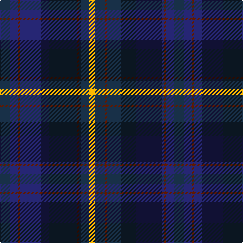

The parent of this is [Edinburgh Monarchs](/tartans/dn/10/db8/dr2/db28/dn28/dr2/dn10/dy/6/)

This was sourced from register-of-tartans.  It is a [8 stripes tartan](/stripes/stripes8/).

Original link https://www.tartanregister.gov.uk/tartanDetails.aspx?ref=1085

## Thread count
DN/10 DB8 DR2 DB28 DN28 DR2 DN10 DY/6

## Palette
Each colour and its ΔE from the base-6 reference it is a variant of.

| Colour | Shade | Base | ΔE (OKLab) |
|---|---|---|---|
| DB |  `#202060` | B  | 0.11 |
| DN |  `#14283C` | B  | 0.14 |
| DR |  `#501400` | B  | 0.22 |
| DY |  `#D09800` | Y  | 0.11 |

# Sample pattern

ID: /variants/dn/10/db8/dr2/db28/dn28/dr2/dn10/dy/6-db202060-dn14283c-dr501400-dyd09800/
