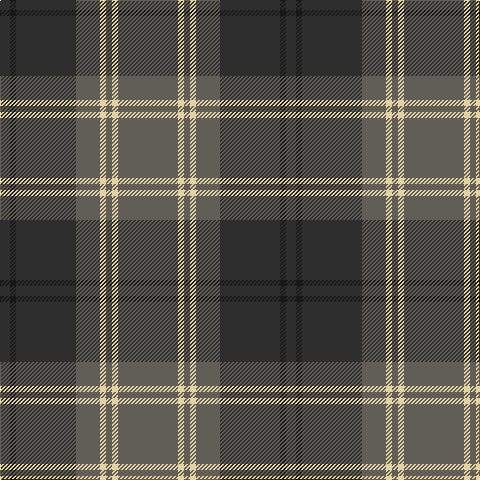

The parent of this is [Dama Classic](/tartans/dn/10/k6/dn60/n24/lr6/n6/lr6/n/60/)

This was sourced from register-of-tartans.  It is a [8 stripes tartan](/stripes/stripes8/).

Original link https://www.tartanregister.gov.uk/tartanDetails.aspx?ref=10208

## Thread count
DN/10 K6 DN60 N24 LR6 N6 LR6 N/60

## Palette
Each colour and its ΔE from the base-6 reference it is a variant of.

| Colour | Shade | Base | ΔE (OKLab) |
|---|---|---|---|
| DN |  `#2E2E2E` | B  | 0.15 |
| K |  `#181818` | K  | 0.21 |
| LR |  `#E2D1A3` | Y  | 0.11 |
| N |  `#615E57` | G  | 0.15 |

# Sample pattern

ID: /variants/dn/10/k6/dn60/n24/lr6/n6/lr6/n/60-dn2e2e2e-k181818-lre2d1a3-n615e57/
