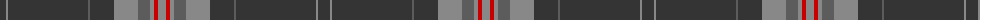

The parent of this is [Dark Lochnagar](/tartans/dn/12/n2/dn80/na2/dn24/n24/na12/n4/r4/n/8/)

This was sourced from register-of-tartans.  It is a [10 stripes tartan](/stripes/stripes10/).

Original link https://www.tartanregister.gov.uk/tartanDetails.aspx?ref=890

## Thread count
DN/12 N2 DN80 Na2 DN24 N24 Na12 N4 R4 N/8

## Palette
Each colour and its ΔE from the base-6 reference it is a variant of.

| Colour | Shade | Base | ΔE (OKLab) |
|---|---|---|---|
| DN |  `#343434` | B  | 0.14 |
| N |  `#888888` | R  | 0.24 |
| Na |  `#5C5C5C` | B  | 0.14 |
| R |  `#C80000` | R  | 0.00 |

ID: /variants/dn/12/n2/dn80/na2/dn24/n24/na12/n4/r4/n/8-dn343434-n888888-na5c5c5c-rc80000/
