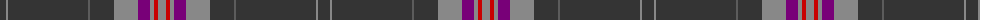

The parent of this is [Lochnagar Dark (Fashion)](/tartans/dn/12/na2/dn80/n2/dn24/na24/p12/na4/r4/na/8/)

This was sourced from tartans-authority.  It is a [10 stripes tartan](/stripes/stripes10/).

Original link http://www.tartansauthority.com/tartan-ferret/display/7327/

## Thread count
DN/12 Na2 DN80 N2 DN24 Na24 P12 Na4 R4 Na/8

## Palette
Each colour and its ΔE from the base-6 reference it is a variant of.

| Colour | Shade | Base | ΔE (OKLab) |
|---|---|---|---|
| DN |  `#343434` | B  | 0.14 |
| N |  `#5C5C5C` | B  | 0.14 |
| Na |  `#888888` | R  | 0.24 |
| P |  `#780078` | B  | 0.16 |
| R |  `#C80000` | R  | 0.00 |

ID: /variants/dn/12/na2/dn80/n2/dn24/na24/p12/na4/r4/na/8-dn343434-n5c5c5c-na888888-p780078-rc80000/
