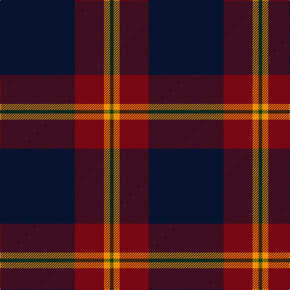

The parent of this is [Meaux, Luc G (Personal)](/tartans/dn/124/dr48/o10/g/6/)

This was sourced from register-of-tartans.  It is a [4 stripes tartan](/stripes/stripes4/).

Original link https://www.tartanregister.gov.uk/tartanDetails.aspx?ref=10738

## Thread count
DN/124 DR48 O10 G/6

## Palette
Each colour and its ΔE from the base-6 reference it is a variant of.

| Colour | Shade | Base | ΔE (OKLab) |
|---|---|---|---|
| DN |  `#05132F` | K  | 0.20 |
| DR |  `#780713` | R  | 0.17 |
| G |  `#084106` | G  | 0.12 |
| O |  `#EF8F06` | Y  | 0.12 |

# Sample pattern

ID: /variants/dn/124/dr48/o10/g/6-dn05132f-dr780713-g084106-oef8f06/
