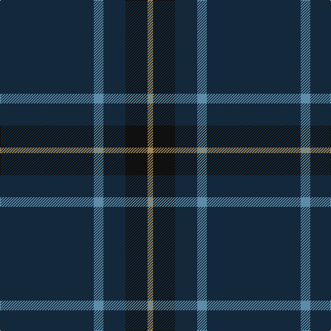

The parent of this is [Burnetts & Struth](/tartans/dn/136/b14/dn32/k32/lt/8/)

This was sourced from register-of-tartans.  It is a [5 stripes tartan](/stripes/stripes5/).

Original link https://www.tartanregister.gov.uk/tartanDetails.aspx?ref=446

## Thread count
DN/136 B14 DN32 K32 LT/8

## Palette
Each colour and its ΔE from the base-6 reference it is a variant of.

| Colour | Shade | Base | ΔE (OKLab) |
|---|---|---|---|
| B |  `#5C8CA8` | B  | 0.23 |
| DN |  `#14283C` | B  | 0.14 |
| K |  `#101010` | K  | 0.17 |
| LT |  `#A08858` | Y  | 0.21 |

# Sample pattern

ID: /variants/dn/136/b14/dn32/k32/lt/8-b5c8ca8-dn14283c-k101010-lta08858/
