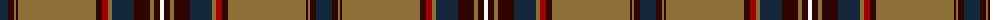

The parent of this is [Afghanistan Memorial](/tartans/dn/16/dr6/lt2/dr2/lt78/dr6/dra6/lt4/dn22/dr16/lt4/dr6/w/4/)

This was sourced from tartans-authority.  It is a [13 stripes tartan](/stripes/stripes13/).

Original link http://www.tartansauthority.com/tartan-ferret/display/10425/

## Thread count
DN/16 DR6 LT2 DR2 LT78 DR6 DRa6 LT4 DN22 DR16 LT4 DR6 W/4

## Palette
Each colour and its ΔE from the base-6 reference it is a variant of.

| Colour | Shade | Base | ΔE (OKLab) |
|---|---|---|---|
| DN |  `#14283C` | B  | 0.14 |
| DR |  `#300500` | K  | 0.22 |
| DRa |  `#A00000` | R  | 0.09 |
| LT |  `#8C7038` | G  | 0.18 |
| W |  `#FCFCFC` | W  | 0.03 |

ID: /variants/dn/16/dr6/lt2/dr2/lt78/dr6/dra6/lt4/dn22/dr16/lt4/dr6/w/4-dn14283c-dr300500-draa00000-lt8c7038-wfcfcfc/
