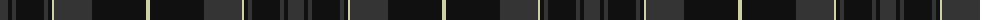

The parent of this is [Pride of Scotland, Muted (Fashion)](/tartans/dn/16/k4/dn4/k28/dn4/k4/lr2/dn38/k54/lr/4/)

This was sourced from tartans-authority.  It is a [10 stripes tartan](/stripes/stripes10/).

Original link http://www.tartansauthority.com/tartan-ferret/display/7477/

## Thread count
DN/16 K4 DN4 K28 DN4 K4 LR2 DN38 K54 LR/4

## Palette
Each colour and its ΔE from the base-6 reference it is a variant of.

| Colour | Shade | Base | ΔE (OKLab) |
|---|---|---|---|
| DN |  `#343434` | B  | 0.14 |
| K |  `#101010` | K  | 0.17 |
| LR |  `#D0D0A8` | Y  | 0.12 |

ID: /variants/dn/16/k4/dn4/k28/dn4/k4/lr2/dn38/k54/lr/4-dn343434-k101010-lrd0d0a8/
