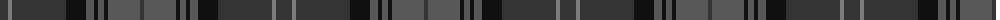

The parent of this is [Highland Granite (Fashion)](/tartans/dn/16/n4/dn54/k20/na8/k4/na6/k4/na32/dn/4/)

This was sourced from tartans-authority.  It is a [10 stripes tartan](/stripes/stripes10/).

Original link http://www.tartansauthority.com/tartan-ferret/display/6499/

## Thread count
DN/16 N4 DN54 K20 Na8 K4 Na6 K4 Na32 DN/4

## Palette
Each colour and its ΔE from the base-6 reference it is a variant of.

| Colour | Shade | Base | ΔE (OKLab) |
|---|---|---|---|
| DN |  `#343434` | B  | 0.14 |
| K |  `#101010` | K  | 0.17 |
| N |  `#7C7C7C` | G  | 0.21 |
| Na |  `#585858` | B  | 0.13 |

ID: /variants/dn/16/n4/dn54/k20/na8/k4/na6/k4/na32/dn/4-dn343434-k101010-n7c7c7c-na585858/
