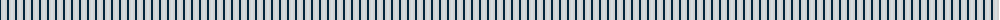
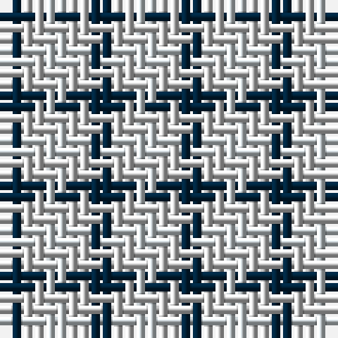

The parent of this is [Glen Moriston (Estate Check)](/tartans/dn/2/n2/ln/2/)

This was sourced from tartans-authority.  It is a [3 stripes tartan](/stripes/stripes3/).

Original link http://www.tartansauthority.com/tartan-ferret/display/7331/

## Thread count
DN/2 N2 LN/2

## Palette
Each colour and its ΔE from the base-6 reference it is a variant of.

| Colour | Shade | Base | ΔE (OKLab) |
|---|---|---|---|
| DN |  `#00243C` | B  | 0.16 |
| LN |  `#D4DCE0` | W  | 0.08 |
| N |  `#D0D0D0` | W  | 0.11 |

# Sample pattern

ID: /variants/dn/2/n2/ln/2-dn00243c-lnd4dce0-nd0d0d0/
