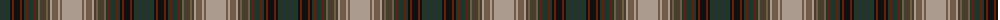

The parent of this is [Spice of Life](/tartans/dn/20/k2/ta2/k6/ta2/k2/dn2/ta2/dn6/ta2/dn2/na2/t6/na2/t2/n2/na6/n2/na2/n/20/)

This was sourced from register-of-tartans.  It is a [20 stripes tartan](/stripes/stripes20/).

Original link https://www.tartanregister.gov.uk/tartanDetails.aspx?ref=10165

## Thread count
DN/20 K2 Ta2 K6 Ta2 K2 DN2 Ta2 DN6 Ta2 DN2 Na2 T6 Na2 T2 N2 Na6 N2 Na2 N/20

## Palette
Each colour and its ΔE from the base-6 reference it is a variant of.

| Colour | Shade | Base | ΔE (OKLab) |
|---|---|---|---|
| DN |  `#21352A` | B  | 0.16 |
| K |  `#101010` | K  | 0.17 |
| N |  `#AB9B8E` | Y  | 0.19 |
| Na |  `#725B49` | G  | 0.16 |
| T |  `#463F2C` | G  | 0.15 |
| Ta |  `#661E08` | R  | 0.21 |

ID: /variants/dn/20/k2/ta2/k6/ta2/k2/dn2/ta2/dn6/ta2/dn2/na2/t6/na2/t2/n2/na6/n2/na2/n/20-dn21352a-k101010-nab9b8e-na725b49-t463f2c-ta661e08/
