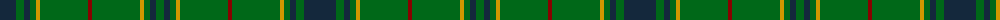

The parent of this is [St Andrews Links Corporate Tartan Tartan Number: 2391. Earliest known date: May 1997 Designed by Polly Wittering of the House of Edgar 1997. Corporate tartan for use on merchandise. Green lightened here to show the sett. See products available Copyright © Blair Urquhart, Comrie, 2015](/tartans/dn/32/g8/dn6/g6/dy4/g48/dr4/g48/dy4/g6/dn6/g/8/)

This was sourced from house-of-tartan.  It is a [12 stripes tartan](/stripes/stripes12/).

Original link http://www.house-of-tartan.scotland.net/house/TartanViewjs.asp?colr=Def&tnam=2391

## Thread count
DN/32 G8 DN6 G6 DY4 G48 DR4 G48 DY4 G6 DN6 G/8

## Palette
Each colour and its ΔE from the base-6 reference it is a variant of.

| Colour | Shade | Base | ΔE (OKLab) |
|---|---|---|---|
| DB |  `#1C0070` | B  | 0.14 |
| DG |  `#003820` | G  | 0.16 |
| DN |  `#14283C` | B  | 0.14 |
| DR |  `#880000` | R  | 0.14 |
| DY |  `#D09800` | Y  | 0.11 |
| G |  `#006818` | G  | 0.02 |
| K |  `#101010` | K  | 0.17 |

ID: /variants/dn/32/g8/dn6/g6/dy4/g48/dr4/g48/dy4/g6/dn6/g/8-db1c0070-dg003820-dn14283c-dr880000-dyd09800-g006818-k101010/
