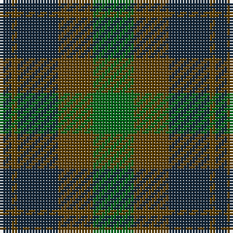

The parent of this is [Bright of Garth (Personal)](/tartans/dn/4/t2/dn14/t12/g/14/)

This was sourced from register-of-tartans.  It is a [5 stripes tartan](/stripes/stripes5/).

Original link https://www.tartanregister.gov.uk/tartanDetails.aspx?ref=353

## Thread count
DN/4 T2 DN14 T12 G/14

## Palette
Each colour and its ΔE from the base-6 reference it is a variant of.

| Colour | Shade | Base | ΔE (OKLab) |
|---|---|---|---|
| DB |  `#2C2C80` | B  | 0.05 |
| DN |  `#14283C` | B  | 0.14 |
| G |  `#006818` | G  | 0.02 |
| T |  `#604000` | G  | 0.14 |

# Sample pattern

ID: /variants/dn/4/t2/dn14/t12/g/14-db2c2c80-dn14283c-g006818-t604000/
