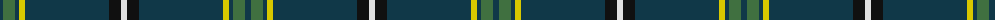

The parent of this is [Bro-sant-Brieg (Corporate)](/tartans/dn/6/g12/dn4/y6/dn84/k12/ln/6/)

This was sourced from tartans-authority.  It is a [7 stripes tartan](/stripes/stripes7/).

Original link http://www.tartansauthority.com/tartan-ferret/display/6654/

## Thread count
DN/6 G12 DN4 Y6 DN84 K12 LN/6

## Palette
Each colour and its ΔE from the base-6 reference it is a variant of.

| Colour | Shade | Base | ΔE (OKLab) |
|---|---|---|---|
| DN |  `#103848` | B  | 0.11 |
| G |  `#407040` | G  | 0.08 |
| K |  `#101010` | K  | 0.17 |
| LN |  `#E0E0E0` | W  | 0.06 |
| Y |  `#D8C800` | Y  | 0.03 |

# Sample pattern

ID: /variants/dn/6/g12/dn4/y6/dn84/k12/ln/6-dn103848-g407040-k101010-lne0e0e0-yd8c800/
