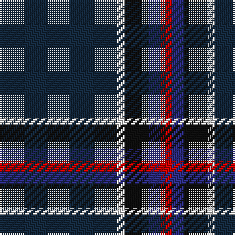

The parent of this is [Edinburgh Crystal (Corporate)](/tartans/dn/60/ln4/k12/db6/r/6/)

This was sourced from tartans-authority.  It is a [5 stripes tartan](/stripes/stripes5/).

Original link http://www.tartansauthority.com/tartan-ferret/display/2307/

## Thread count
DN/60 LN4 K12 DB6 R/6

## Palette
Each colour and its ΔE from the base-6 reference it is a variant of.

| Colour | Shade | Base | ΔE (OKLab) |
|---|---|---|---|
| DB |  `#2C2C80` | B  | 0.05 |
| DN |  `#14283C` | B  | 0.14 |
| K |  `#101010` | K  | 0.17 |
| LN |  `#E0E0E0` | W  | 0.06 |
| R |  `#C80000` | R  | 0.00 |

# Sample pattern

ID: /variants/dn/60/ln4/k12/db6/r/6-db2c2c80-dn14283c-k101010-lne0e0e0-rc80000/
