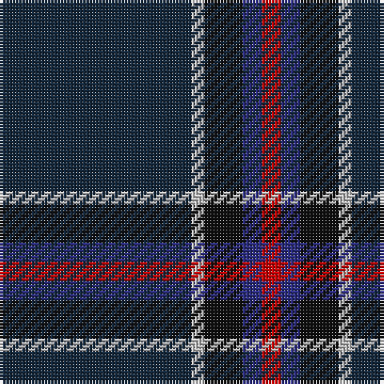

The parent of this is [Edinburgh Crystal](/tartans/dn/60/n4/k12/db6/r/6/)

This was sourced from register-of-tartans.  It is a [5 stripes tartan](/stripes/stripes5/).

Original link https://www.tartanregister.gov.uk/tartanDetails.aspx?ref=1077

## Thread count
DN/60 N4 K12 DB6 R/6

## Palette
Each colour and its ΔE from the base-6 reference it is a variant of.

| Colour | Shade | Base | ΔE (OKLab) |
|---|---|---|---|
| DB |  `#2C2C80` | B  | 0.05 |
| DN |  `#14283C` | B  | 0.14 |
| K |  `#101010` | K  | 0.17 |
| N |  `#C0C0C0` | W  | 0.16 |
| R |  `#C80000` | R  | 0.00 |

# Sample pattern

ID: /variants/dn/60/n4/k12/db6/r/6-db2c2c80-dn14283c-k101010-nc0c0c0-rc80000/
