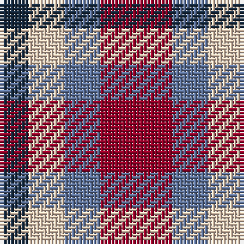

The parent of this is [Haggis Hostels](/tartans/dn/8/lr10/b10/dr/20/)

This was sourced from register-of-tartans.  It is a [4 stripes tartan](/stripes/stripes4/).

Original link https://www.tartanregister.gov.uk/tartanDetails.aspx?ref=11035

## Thread count
DN/8 LR10 B10 DR/20

## Palette
Each colour and its ΔE from the base-6 reference it is a variant of.

| Colour | Shade | Base | ΔE (OKLab) |
|---|---|---|---|
| B |  `#5F749C` | B  | 0.17 |
| DN |  `#14283C` | B  | 0.14 |
| DR |  `#960028` | R  | 0.11 |
| LR |  `#E8CCB8` | W  | 0.11 |

# Sample pattern

ID: /variants/dn/8/lr10/b10/dr/20-b5f749c-dn14283c-dr960028-lre8ccb8/
