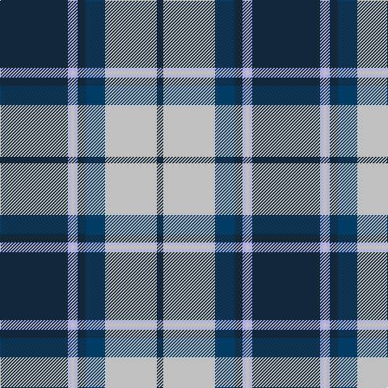

The parent of this is [Longniddry, Blue (Dance)](/tartans/dn/84/lp4/n4/lp4/dn10/db24/n64/dn/8/)

This was sourced from tartans-authority.  It is a [8 stripes tartan](/stripes/stripes8/).

Original link http://www.tartansauthority.com/tartan-ferret/display/5486/

## Thread count
DN/84 LP4 N4 LP4 DN10 DB24 N64 DN/8

## Palette
Each colour and its ΔE from the base-6 reference it is a variant of.

| Colour | Shade | Base | ΔE (OKLab) |
|---|---|---|---|
| DB |  `#003C64` | B  | 0.07 |
| DN |  `#14283C` | B  | 0.14 |
| LP |  `#A8ACE8` | W  | 0.22 |
| N |  `#C0C0C0` | W  | 0.16 |

# Sample pattern

ID: /variants/dn/84/lp4/n4/lp4/dn10/db24/n64/dn/8-db003c64-dn14283c-lpa8ace8-nc0c0c0/
