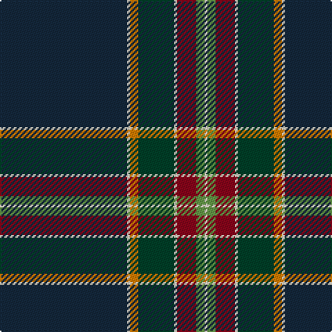

The parent of this is [Victorian Highland Pipe Band Association (Australia)](/tartans/dn/92/w2/o6/dg26/w2/dr14/lg6/w/2/)

This was sourced from register-of-tartans.  It is a [8 stripes tartan](/stripes/stripes8/).

Original link https://www.tartanregister.gov.uk/tartanDetails.aspx?ref=11050

## Thread count
DN/92 W2 O6 DG26 W2 DR14 LG6 W/2

## Palette
Each colour and its ΔE from the base-6 reference it is a variant of.

| Colour | Shade | Base | ΔE (OKLab) |
|---|---|---|---|
| DG |  `#004028` | G  | 0.14 |
| DN |  `#14283C` | B  | 0.14 |
| DR |  `#89051B` | R  | 0.14 |
| LG |  `#649848` | G  | 0.19 |
| O |  `#D87C00` | Y  | 0.17 |
| W |  `#F0E0C8` | W  | 0.06 |

# Sample pattern

ID: /variants/dn/92/w2/o6/dg26/w2/dr14/lg6/w/2-dg004028-dn14283c-dr89051b-lg649848-od87c00-wf0e0c8/
