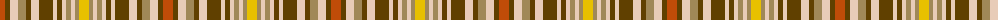

The parent of this is [Glen Forest (Fashion)](/tartans/do/10/t5/lr8/lt8/t5/lr8/t14/lr4/t5/lr4/lt5/lr4/lt4/y/10/)

This was sourced from tartans-authority.  It is a [14 stripes tartan](/stripes/stripes14/).

Original link http://www.tartansauthority.com/tartan-ferret/display/5010/

## Thread count
DO/10 T5 LR8 LT8 T5 LR8 T14 LR4 T5 LR4 LT5 LR4 LT4 Y/10

## Palette
Each colour and its ΔE from the base-6 reference it is a variant of.

| Colour | Shade | Base | ΔE (OKLab) |
|---|---|---|---|
| DO |  `#C04C08` | R  | 0.08 |
| LR |  `#E8CCB8` | W  | 0.11 |
| LT |  `#A08858` | Y  | 0.21 |
| T |  `#604000` | G  | 0.14 |
| Y |  `#E8C000` | Y  | 0.00 |

ID: /variants/do/10/t5/lr8/lt8/t5/lr8/t14/lr4/t5/lr4/lt5/lr4/lt4/y/10-doc04c08-lre8ccb8-lta08858-t604000-ye8c000/
