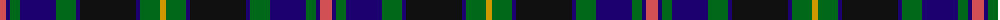

The parent of this is [Ofally, County (District)](/tartans/do/12/db4/g10/db36/g20/db4/k56/db4/g20/dy/6/)

This was sourced from tartans-authority.  It is a [10 stripes tartan](/stripes/stripes10/).

Original link http://www.tartansauthority.com/tartan-ferret/display/2268/

## Thread count
DO/12 DB4 G10 DB36 G20 DB4 K56 DB4 G20 DY/6

## Palette
Each colour and its ΔE from the base-6 reference it is a variant of.

| Colour | Shade | Base | ΔE (OKLab) |
|---|---|---|---|
| DB |  `#1C0070` | B  | 0.14 |
| DO |  `#D05054` | R  | 0.10 |
| DY |  `#D09800` | Y  | 0.11 |
| G |  `#006818` | G  | 0.02 |
| K |  `#101010` | K  | 0.17 |

ID: /variants/do/12/db4/g10/db36/g20/db4/k56/db4/g20/dy/6-db1c0070-dod05054-dyd09800-g006818-k101010/
