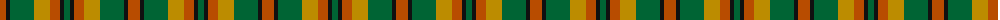
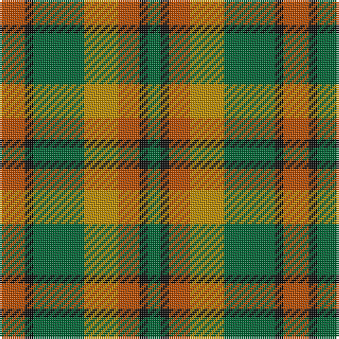

The parent of this is [Londonderry, County (District)](/tartans/do/12/k4/g24/dy16/do10/k4/g/6/)

This was sourced from tartans-authority.  It is a [7 stripes tartan](/stripes/stripes7/).

Original link http://www.tartansauthority.com/tartan-ferret/display/2279/

## Thread count
DO/12 K4 G24 DY16 DO10 K4 G/6

## Palette
Each colour and its ΔE from the base-6 reference it is a variant of.

| Colour | Shade | Base | ΔE (OKLab) |
|---|---|---|---|
| DO |  `#B84C00` | R  | 0.08 |
| DY |  `#BC8C00` | Y  | 0.16 |
| G |  `#006434` | G  | 0.04 |
| K |  `#101010` | K  | 0.17 |

# Sample pattern

ID: /variants/do/12/k4/g24/dy16/do10/k4/g/6-dob84c00-dybc8c00-g006434-k101010/
