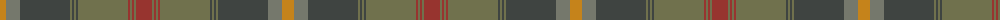

The parent of this is [Johansson (Aneby, Sweden), Christian (Personal)](/tartans/do/12/na14/n50/g2/n2/g2/n2/g50/dr2/g2/dr2/g2/dr/16/)

This was sourced from register-of-tartans.  It is a [13 stripes tartan](/stripes/stripes13/).

Original link https://www.tartanregister.gov.uk/tartanDetails.aspx?ref=10457

## Thread count
DO/12 Na14 N50 G2 N2 G2 N2 G50 DR2 G2 DR2 G2 DR/16

## Palette
Each colour and its ΔE from the base-6 reference it is a variant of.

| Colour | Shade | Base | ΔE (OKLab) |
|---|---|---|---|
| DO |  `#C5831B` | Y  | 0.17 |
| DR |  `#97342F` | R  | 0.10 |
| G |  `#70714D` | G  | 0.15 |
| N |  `#3F4441` | B  | 0.12 |
| Na |  `#75786C` | G  | 0.19 |

ID: /variants/do/12/na14/n50/g2/n2/g2/n2/g50/dr2/g2/dr2/g2/dr/16-doc5831b-dr97342f-g70714d-n3f4441-na75786c/
