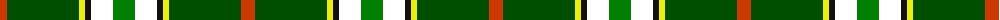

The parent of this is [Driver, RC](/tartans/do/14/g72/y6/k6/w22/ga/22/)

This was sourced from register-of-tartans.  It is a [6 stripes tartan](/stripes/stripes6/).

Original link https://www.tartanregister.gov.uk/tartanDetails.aspx?ref=10161

## Thread count
DO/14 G72 Y6 K6 W22 Ga/22

## Palette
Each colour and its ΔE from the base-6 reference it is a variant of.

| Colour | Shade | Base | ΔE (OKLab) |
|---|---|---|---|
| DO |  `#CD3700` | R  | 0.05 |
| G |  `#004F00` | G  | 0.07 |
| Ga |  `#008000` | G  | 0.09 |
| K |  `#101010` | K  | 0.17 |
| W |  `#FFFFFF` | W  | 0.03 |
| Y |  `#EEEE00` | Y  | 0.12 |

# Sample pattern

ID: /variants/do/14/g72/y6/k6/w22/ga/22-docd3700-g004f00-ga008000-k101010-wffffff-yeeee00/
