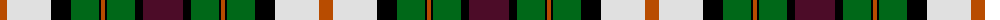

The parent of this is [Border Union Cattle Show (Corporate)](/tartans/do/14/ln44/k20/g28/k2/do4/k2/g28/k8/dr/40/)

This was sourced from tartans-authority.  It is a [10 stripes tartan](/stripes/stripes10/).

Original link http://www.tartansauthority.com/tartan-ferret/display/3715/

## Thread count
DO/14 LN44 K20 G28 K2 DO4 K2 G28 K8 DR/40

## Palette
Each colour and its ΔE from the base-6 reference it is a variant of.

| Colour | Shade | Base | ΔE (OKLab) |
|---|---|---|---|
| DO |  `#B84C00` | R  | 0.08 |
| DR |  `#4C0C28` | B  | 0.19 |
| G |  `#006818` | G  | 0.02 |
| K |  `#000000` | K  | 0.00 |
| LN |  `#E0E0E0` | W  | 0.06 |

ID: /variants/do/14/ln44/k20/g28/k2/do4/k2/g28/k8/dr/40-dob84c00-dr4c0c28-g006818-k000000-lne0e0e0/
