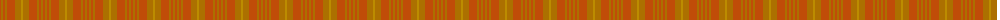
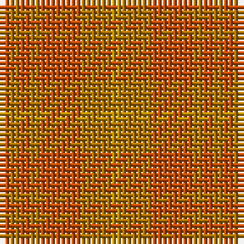

The parent of this is [Burns' Birthplace (Commem)](/tartans/do/2/dya2/do2/dya2/do8/dya6/dy/2/)

This was sourced from tartans-authority.  It is a [7 stripes tartan](/stripes/stripes7/).

Original link http://www.tartansauthority.com/tartan-ferret/display/8253/

## Thread count
DO/2 DYa2 DO2 DYa2 DO8 DYa6 DY/2

## Palette
Each colour and its ΔE from the base-6 reference it is a variant of.

| Colour | Shade | Base | ΔE (OKLab) |
|---|---|---|---|
| DO |  `#C04C08` | R  | 0.08 |
| DY |  `#BC8C00` | Y  | 0.16 |
| DYa |  `#AC7000` | R  | 0.17 |

# Sample pattern

ID: /variants/do/2/dya2/do2/dya2/do8/dya6/dy/2-doc04c08-dybc8c00-dyaac7000/
