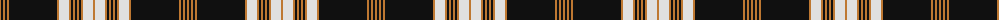

The parent of this is [MacGuinness](/tartans/do/2/k2/do2/k2/do2/k48/do2/ln10/do2/k2/do2/k2/do2/k2/do2/ln10/do/2/)

This was sourced from register-of-tartans.  It is a [17 stripes tartan](/stripes/stripes17/).

Original link https://www.tartanregister.gov.uk/tartanDetails.aspx?ref=2463

## Thread count
DO/2 K2 DO2 K2 DO2 K48 DO2 LN10 DO2 K2 DO2 K2 DO2 K2 DO2 LN10 DO/2

## Palette
Each colour and its ΔE from the base-6 reference it is a variant of.

| Colour | Shade | Base | ΔE (OKLab) |
|---|---|---|---|
| DO |  `#BE7832` | R  | 0.17 |
| K |  `#101010` | K  | 0.17 |
| LN |  `#E0E0E0` | W  | 0.06 |

ID: /variants/do/2/k2/do2/k2/do2/k48/do2/ln10/do2/k2/do2/k2/do2/k2/do2/ln10/do/2-dobe7832-k101010-lne0e0e0/
