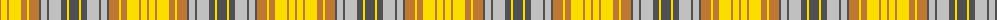

The parent of this is [MacGlashan #2](/tartans/do/2/y6/do2/y12/do6/y2/do10/n2/na6/n2/na12/n6/y2/n/10/)

This was sourced from register-of-tartans.  It is a [14 stripes tartan](/stripes/stripes14/).

Original link https://www.tartanregister.gov.uk/tartanDetails.aspx?ref=2445

## Thread count
DO/2 Y6 DO2 Y12 DO6 Y2 DO10 N2 Na6 N2 Na12 N6 Y2 N/10

## Palette
Each colour and its ΔE from the base-6 reference it is a variant of.

| Colour | Shade | Base | ΔE (OKLab) |
|---|---|---|---|
| DO |  `#BE7832` | R  | 0.17 |
| N |  `#505050` | B  | 0.12 |
| Na |  `#C0C0C0` | W  | 0.16 |
| Y |  `#FADC00` | Y  | 0.08 |

ID: /variants/do/2/y6/do2/y12/do6/y2/do10/n2/na6/n2/na12/n6/y2/n/10-dobe7832-n505050-nac0c0c0-yfadc00/
