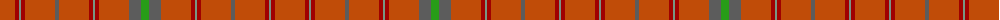

The parent of this is [Ross, David (Commemorative)](/tartans/do/30/dr4/lg2/dr4/do30/n4/do30/dr4/lg2/dr4/do30/n12/g/8/)

This was sourced from tartans-authority.  It is a [13 stripes tartan](/stripes/stripes13/).

Original link http://www.tartansauthority.com/tartan-ferret/display/6103/

## Thread count
DO/30 DR4 LG2 DR4 DO30 N4 DO30 DR4 LG2 DR4 DO30 N12 G/8

## Palette
Each colour and its ΔE from the base-6 reference it is a variant of.

| Colour | Shade | Base | ΔE (OKLab) |
|---|---|---|---|
| DO |  `#C04C08` | R  | 0.08 |
| DR |  `#A00000` | R  | 0.09 |
| G |  `#289C18` | G  | 0.18 |
| LG |  `#789484` | G  | 0.23 |
| N |  `#5C5C5C` | B  | 0.14 |

ID: /variants/do/30/dr4/lg2/dr4/do30/n4/do30/dr4/lg2/dr4/do30/n12/g/8-doc04c08-dra00000-g289c18-lg789484-n5c5c5c/
