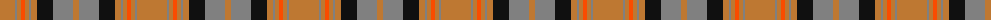

The parent of this is [Annan](/tartans/do/30/n2/do4/r4/do4/n2/do6/k16/n20/do/6/)

This was sourced from register-of-tartans.  It is a [10 stripes tartan](/stripes/stripes10/).

Original link https://www.tartanregister.gov.uk/tartanDetails.aspx?ref=91

## Thread count
DO/30 N2 DO4 R4 DO4 N2 DO6 K16 N20 DO/6

## Palette
Each colour and its ΔE from the base-6 reference it is a variant of.

| Colour | Shade | Base | ΔE (OKLab) |
|---|---|---|---|
| DO |  `#BE7832` | R  | 0.17 |
| K |  `#101010` | K  | 0.17 |
| N |  `#808080` | G  | 0.22 |
| R |  `#FA4B00` | R  | 0.14 |

ID: /variants/do/30/n2/do4/r4/do4/n2/do6/k16/n20/do/6-dobe7832-k101010-n808080-rfa4b00/
