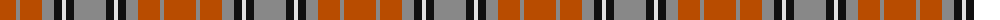

The parent of this is [Sydney (Nova Scotia) (District)](/tartans/do/32/n4/do22/n12/k8/ln4/k8/n/32/)

This was sourced from tartans-authority.  It is a [8 stripes tartan](/stripes/stripes8/).

Original link http://www.tartansauthority.com/tartan-ferret/display/1291/

## Thread count
DO/32 N4 DO22 N12 K8 LN4 K8 N/32

## Palette
Each colour and its ΔE from the base-6 reference it is a variant of.

| Colour | Shade | Base | ΔE (OKLab) |
|---|---|---|---|
| DO |  `#B84C00` | R  | 0.08 |
| K |  `#101010` | K  | 0.17 |
| LN |  `#E0E0E0` | W  | 0.06 |
| N |  `#888888` | R  | 0.24 |

# Sample pattern

ID: /variants/do/32/n4/do22/n12/k8/ln4/k8/n/32-dob84c00-k101010-lne0e0e0-n888888/
