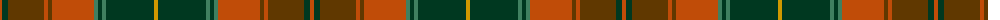

The parent of this is [Methven](/tartans/do/4/dg6/t36/do4/t4/do42/g4/dg4/g4/dg48/dy/4/)

This was sourced from tartans-authority.  It is a [11 stripes tartan](/stripes/stripes11/).

Original link http://www.tartansauthority.com/tartan-ferret/display/11092/

## Thread count
DO/4 DG6 T36 DO4 T4 DO42 G4 DG4 G4 DG48 DY/4

## Palette
Each colour and its ΔE from the base-6 reference it is a variant of.

| Colour | Shade | Base | ΔE (OKLab) |
|---|---|---|---|
| DG |  `#003820` | G  | 0.16 |
| DO |  `#C04C08` | R  | 0.08 |
| DY |  `#D09800` | Y  | 0.11 |
| G |  `#408060` | G  | 0.13 |
| T |  `#603800` | G  | 0.16 |

ID: /variants/do/4/dg6/t36/do4/t4/do42/g4/dg4/g4/dg48/dy/4-dg003820-doc04c08-dyd09800-g408060-t603800/
