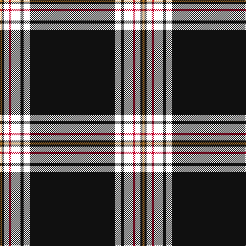

The parent of this is [Crane of Cluny Mourning](/tartans/do/4/k4/w10/r4/w18/k6/w12/k/166/)

This was sourced from register-of-tartans.  It is a [8 stripes tartan](/stripes/stripes8/).

Original link https://www.tartanregister.gov.uk/tartanDetails.aspx?ref=6002

## Thread count
DO/4 K4 W10 R4 W18 K6 W12 K/166

## Palette
Each colour and its ΔE from the base-6 reference it is a variant of.

| Colour | Shade | Base | ΔE (OKLab) |
|---|---|---|---|
| DO |  `#C2812D` | Y  | 0.18 |
| K |  `#101010` | K  | 0.17 |
| R |  `#C20029` | R  | 0.03 |
| W |  `#FFFFFF` | W  | 0.03 |

# Sample pattern

ID: /variants/do/4/k4/w10/r4/w18/k6/w12/k/166-doc2812d-k101010-rc20029-wffffff/
