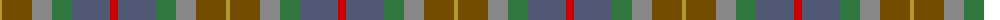

The parent of this is [Isle of Rona](/tartans/do/4/t30/n20/g20/na38/r/8/)

This was sourced from register-of-tartans.  It is a [6 stripes tartan](/stripes/stripes6/).

Original link https://www.tartanregister.gov.uk/tartanDetails.aspx?ref=5775

## Thread count
DO/4 T30 N20 G20 Na38 R/8

## Palette
Each colour and its ΔE from the base-6 reference it is a variant of.

| Colour | Shade | Base | ΔE (OKLab) |
|---|---|---|---|
| DO |  `#B49830` | Y  | 0.14 |
| G |  `#307840` | G  | 0.09 |
| N |  `#888888` | R  | 0.24 |
| Na |  `#505874` | B  | 0.10 |
| R |  `#C80000` | R  | 0.00 |
| T |  `#744C00` | G  | 0.14 |

# Sample pattern

ID: /variants/do/4/t30/n20/g20/na38/r/8-dob49830-g307840-n888888-na505874-rc80000-t744c00/
