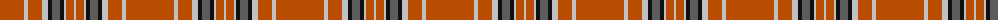

The parent of this is [Vemma (Corporate) XXXXXXXXX](/tartans/do/48/n4/do14/n6/k4/na8/k4/n2/do8/n/2/)

This was sourced from tartans-authority.  It is a [10 stripes tartan](/stripes/stripes10/).

Original link http://www.tartansauthority.com/tartan-ferret/display/10730/

## Thread count
DO/48 N4 DO14 N6 K4 Na8 K4 N2 DO8 N/2

## Palette
Each colour and its ΔE from the base-6 reference it is a variant of.

| Colour | Shade | Base | ΔE (OKLab) |
|---|---|---|---|
| DO |  `#B84C00` | R  | 0.08 |
| K |  `#101010` | K  | 0.17 |
| N |  `#C0C0C0` | W  | 0.16 |
| Na |  `#5C5C5C` | B  | 0.14 |

ID: /variants/do/48/n4/do14/n6/k4/na8/k4/n2/do8/n/2-dob84c00-k101010-nc0c0c0-na5c5c5c/
