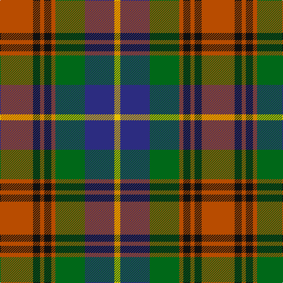

The parent of this is [Sikh](/tartans/do/56/k12/do7/k12/do7/g50/db50/y/10/)

This was sourced from register-of-tartans.  It is a [8 stripes tartan](/stripes/stripes8/).

Original link https://www.tartanregister.gov.uk/tartanDetails.aspx?ref=3785

## Thread count
DO/56 K12 DO7 K12 DO7 G50 DB50 Y/10

## Palette
Each colour and its ΔE from the base-6 reference it is a variant of.

| Colour | Shade | Base | ΔE (OKLab) |
|---|---|---|---|
| DB |  `#2C2C80` | B  | 0.05 |
| DO |  `#B84C00` | R  | 0.08 |
| G |  `#006818` | G  | 0.02 |
| K |  `#101010` | K  | 0.17 |
| Y |  `#E8C000` | Y  | 0.00 |

# Sample pattern

ID: /variants/do/56/k12/do7/k12/do7/g50/db50/y/10-db2c2c80-dob84c00-g006818-k101010-ye8c000/
