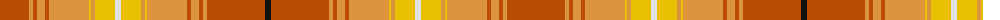

The parent of this is [Shenzhen](/tartans/do/58/oa4/do4/oa8/do4/oa40/y2/oa4/y20/ln6/y20/oa4/y2/oa40/do4/oa8/do4/oa4/do58/k/6/)

This was sourced from register-of-tartans.  It is a [20 stripes tartan](/stripes/stripes20/).

Original link https://www.tartanregister.gov.uk/tartanDetails.aspx?ref=3780

## Thread count
DO/58 Oa4 DO4 Oa8 DO4 Oa40 Y2 Oa4 Y20 LN6 Y20 Oa4 Y2 Oa40 DO4 Oa8 DO4 Oa4 DO58 K/6

## Palette
Each colour and its ΔE from the base-6 reference it is a variant of.

| Colour | Shade | Base | ΔE (OKLab) |
|---|---|---|---|
| DO |  `#B84C00` | R  | 0.08 |
| DY |  `#BC8C00` | Y  | 0.16 |
| K |  `#101010` | K  | 0.17 |
| LN |  `#E0E0E0` | W  | 0.06 |
| O |  `#EC8048` | Y  | 0.17 |
| Oa |  `#DC943C` | Y  | 0.12 |
| W |  `#F8F8F8` | W  | 0.01 |
| Y |  `#E8C000` | Y  | 0.00 |

ID: /variants/do/58/oa4/do4/oa8/do4/oa40/y2/oa4/y20/ln6/y20/oa4/y2/oa40/do4/oa8/do4/oa4/do58/k/6-dob84c00-dybc8c00-k101010-lne0e0e0-oec8048-oadc943c-wf8f8f8-ye8c000/
