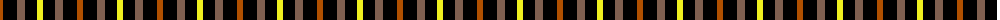

The parent of this is [Daks - Black House Check, C.6700.06](/tartans/do/6/k14/lt8/k12/y/6/)

This was sourced from weddslist.  It is a [5 stripes tartan](/stripes/stripes5/).

Original link http://www.weddslist.com/cgi-bin/tartans/pg.pl?source=sts

## Thread count
DO/6 K14 LT8 K12 Y/6

## Palette
Each colour and its ΔE from the base-6 reference it is a variant of.

| Colour | Shade | Base | ΔE (OKLab) |
|---|---|---|---|
| DO |  `#B05000` | R  | 0.10 |
| K |  `#000000` | K  | 0.00 |
| LT |  `#806050` | R  | 0.17 |
| Y |  `#F0F020` | Y  | 0.12 |

# Sample pattern

ID: /variants/do/6/k14/lt8/k12/y/6-dob05000-k000000-lt806050-yf0f020/
