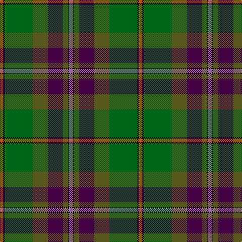

The parent of this is [Aberuchill District Tartan Tartan Number: 6814. Earliest known date: 2005 Aberuchill lends it name to the area south of Comrie where the river Ruchil meets the river Earn. The two rivers form the boundaries of the Aberuchill Estate for which this tartan was created. See products available Copyright © Blair Urquhart, Comrie, 2015](/tartans/do/6/k4/g55/gb30/dp30/gb10/k2/lp/8/)

This was sourced from house-of-tartan.  It is a [8 stripes tartan](/stripes/stripes8/).

Original link http://www.house-of-tartan.scotland.net/house/TartanViewjs.asp?colr=Def&tnam=6814

## Thread count
DO/6 K4 G55 Gb30 DP30 Gb10 K2 LP/8

## Palette
Each colour and its ΔE from the base-6 reference it is a variant of.

| Colour | Shade | Base | ΔE (OKLab) |
|---|---|---|---|
| DG |  `#003820` | G  | 0.16 |
| DO |  `#B84C00` | R  | 0.08 |
| DP |  `#440044` | B  | 0.17 |
| DR |  `#880000` | R  | 0.14 |
| G |  `#006818` | G  | 0.02 |
| Ga |  `#285800` | G  | 0.04 |
| Gb |  `#58581C` | G  | 0.09 |
| K |  `#101010` | K  | 0.17 |
| LP |  `#9C68A4` | R  | 0.21 |
| LT |  `#8C7038` | G  | 0.18 |

# Sample pattern

ID: /variants/do/6/k4/g55/gb30/dp30/gb10/k2/lp/8-dg003820-dob84c00-dp440044-dr880000-g006818-ga285800-gb58581c-k101010-lp9c68a4-lt8c7038/
