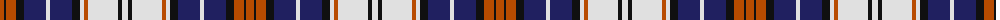

The parent of this is [Tommy (Corporate)](/tartans/do/8/k2/do10/k8/db22/ln4/db22/k8/ln4/do4/ln30/k4/ln/6/)

This was sourced from tartans-authority.  It is a [13 stripes tartan](/stripes/stripes13/).

Original link http://www.tartansauthority.com/tartan-ferret/display/3973/

## Thread count
DO/8 K2 DO10 K8 DB22 LN4 DB22 K8 LN4 DO4 LN30 K4 LN/6

## Palette
Each colour and its ΔE from the base-6 reference it is a variant of.

| Colour | Shade | Base | ΔE (OKLab) |
|---|---|---|---|
| DB |  `#202060` | B  | 0.11 |
| DO |  `#B84C00` | R  | 0.08 |
| K |  `#101010` | K  | 0.17 |
| LN |  `#E0E0E0` | W  | 0.06 |

ID: /variants/do/8/k2/do10/k8/db22/ln4/db22/k8/ln4/do4/ln30/k4/ln/6-db202060-dob84c00-k101010-lne0e0e0/
