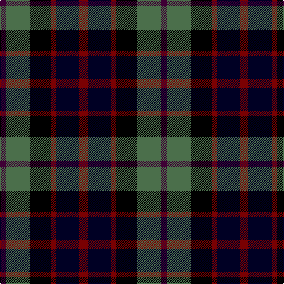

The parent of this is [Williamson (Personal)](/tartans/dp/10/g40/k36/dr8/ka40/dr/14/)

This was sourced from register-of-tartans.  It is a [6 stripes tartan](/stripes/stripes6/).

Original link https://www.tartanregister.gov.uk/tartanDetails.aspx?ref=4629

## Thread count
DP/10 G40 K36 DR8 Ka40 DR/14

## Palette
Each colour and its ΔE from the base-6 reference it is a variant of.

| Colour | Shade | Base | ΔE (OKLab) |
|---|---|---|---|
| DP |  `#3F0035` | B  | 0.19 |
| DR |  `#7A0002` | R  | 0.17 |
| G |  `#4B6F4B` | G  | 0.10 |
| K |  `#000000` | K  | 0.00 |
| Ka |  `#000024` | K  | 0.14 |

# Sample pattern

ID: /variants/dp/10/g40/k36/dr8/ka40/dr/14-dp3f0035-dr7a0002-g4b6f4b-k000000-ka000024/
