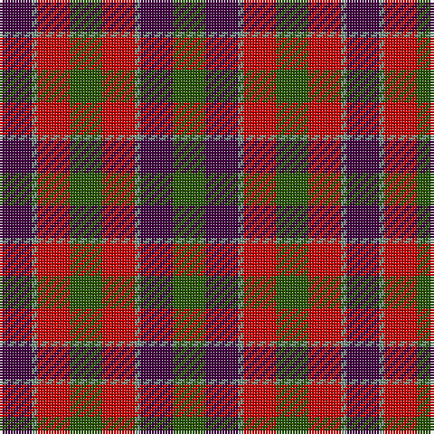

The parent of this is [Wilson's No.223](/tartans/dp/12/lg2/ra12/g12/ra12/lg2/dp12/g/12/)

This was sourced from register-of-tartans.  It is a [8 stripes tartan](/stripes/stripes8/).

Original link https://www.tartanregister.gov.uk/tartanDetails.aspx?ref=4750

## Thread count
DP/12 LG2 Ra12 G12 Ra12 LG2 DP12 G/12

## Palette
Each colour and its ΔE from the base-6 reference it is a variant of.

| Colour | Shade | Base | ΔE (OKLab) |
|---|---|---|---|
| DG |  `#003820` | G  | 0.16 |
| DP |  `#440044` | B  | 0.17 |
| G |  `#285800` | G  | 0.04 |
| LG |  `#789484` | G  | 0.23 |
| R |  `#C80000` | R  | 0.00 |
| Ra |  `#C80000` | R  | 0.00 |

# Sample pattern

ID: /variants/dp/12/lg2/ra12/g12/ra12/lg2/dp12/g/12-dg003820-dp440044-g285800-lg789484-rc80000-rac80000/
