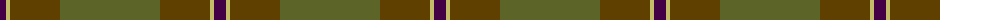
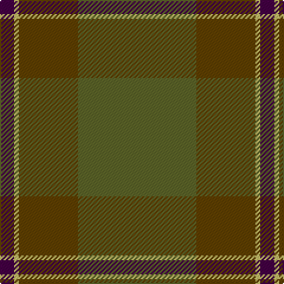

The parent of this is [Highland Greenford (Personal)](/tartans/dp/12/lg4/t50/g/100/)

This was sourced from tartans-authority.  It is a [4 stripes tartan](/stripes/stripes4/).

Original link http://www.tartansauthority.com/tartan-ferret/display/10498/

## Thread count
DP/12 LG4 T50 G/100

## Palette
Each colour and its ΔE from the base-6 reference it is a variant of.

| Colour | Shade | Base | ΔE (OKLab) |
|---|---|---|---|
| DP |  `#440044` | B  | 0.17 |
| G |  `#5C6428` | G  | 0.09 |
| LG |  `#C4BC68` | Y  | 0.07 |
| T |  `#604000` | G  | 0.14 |

# Sample pattern

ID: /variants/dp/12/lg4/t50/g/100-dp440044-g5c6428-lgc4bc68-t604000/
