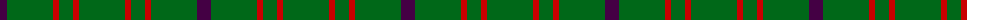
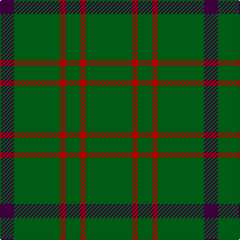

The parent of this is [Highland Spring (Green) Corporate Prom Tartan Tartan Number: 2322. Earliest known date: 1997 Tartan Society notes say "Second tartan for Highland Spring. It is a straight substitution of colours in the original sett (#130). On the relaunch of their packaging a second tartan was needed. It had been found that the 'green' image of the Highlands carried in tartan, increased their product's competitiveness." See products available Copyright © Blair Urquhart, Comrie, 2015](/tartans/dp/14/g46/r6/g14/r6/g/46/)

This was sourced from house-of-tartan.  It is a [6 stripes tartan](/stripes/stripes6/).

Original link http://www.house-of-tartan.scotland.net/house/TartanViewjs.asp?colr=Def&tnam=2322

## Thread count
DP/14 G46 R6 G14 R6 G/46

## Palette
Each colour and its ΔE from the base-6 reference it is a variant of.

| Colour | Shade | Base | ΔE (OKLab) |
|---|---|---|---|
| DG |  `#003820` | G  | 0.16 |
| DP |  `#440044` | B  | 0.17 |
| G |  `#006818` | G  | 0.02 |
| R |  `#C80000` | R  | 0.00 |

# Sample pattern

ID: /variants/dp/14/g46/r6/g14/r6/g/46-dg003820-dp440044-g006818-rc80000/
