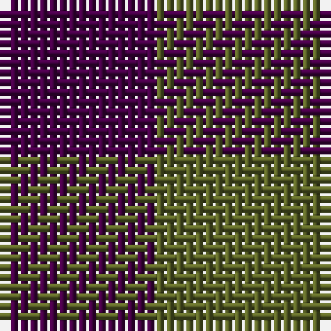

The parent of this is [Wilson's No.116 (light)](/tartans/dp/16/g/18/)

This was sourced from register-of-tartans.  It is a [2 stripes tartan](/stripes/stripes2/).

Original link https://www.tartanregister.gov.uk/tartanDetails.aspx?ref=4682

## Thread count
DP/16 G/18

## Palette
DP G

# Sample pattern

ID: /variants/dp/16/g/18-dp440044-g5c6428/
