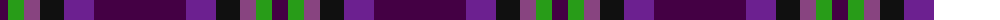

The parent of this is [Haut Name Tartan Tartan Number: 10389. Earliest known date: 1st March 2011 Designed for the Haut family living in Liff by Dundee to celebrate their German and Irish roots and the Scottish identity of their children. See products available Copyright © Blair Urquhart, Comrie, 2015](/tartans/dp/16/g16/lp16/k24/pa30/dp/92/)

This was sourced from house-of-tartan.  It is a [6 stripes tartan](/stripes/stripes6/).

Original link http://www.house-of-tartan.scotland.net/house/TartanViewjs.asp?colr=Def&tnam=10389

## Thread count
DP/16 G16 LP16 K24 Pa30 DP/92

## Palette
Each colour and its ΔE from the base-6 reference it is a variant of.

| Colour | Shade | Base | ΔE (OKLab) |
|---|---|---|---|
| DP |  `#440044` | B  | 0.17 |
| G |  `#289C18` | G  | 0.18 |
| K |  `#101010` | K  | 0.17 |
| LP |  `#884480` | B  | 0.16 |
| N |  `#5C5C5C` | B  | 0.14 |
| P |  `#780078` | B  | 0.16 |
| Pa |  `#6C2090` | B  | 0.12 |

# Sample pattern

ID: /variants/dp/16/g16/lp16/k24/pa30/dp/92-dp440044-g289c18-k101010-lp884480-n5c5c5c-p780078-pa6c2090/
